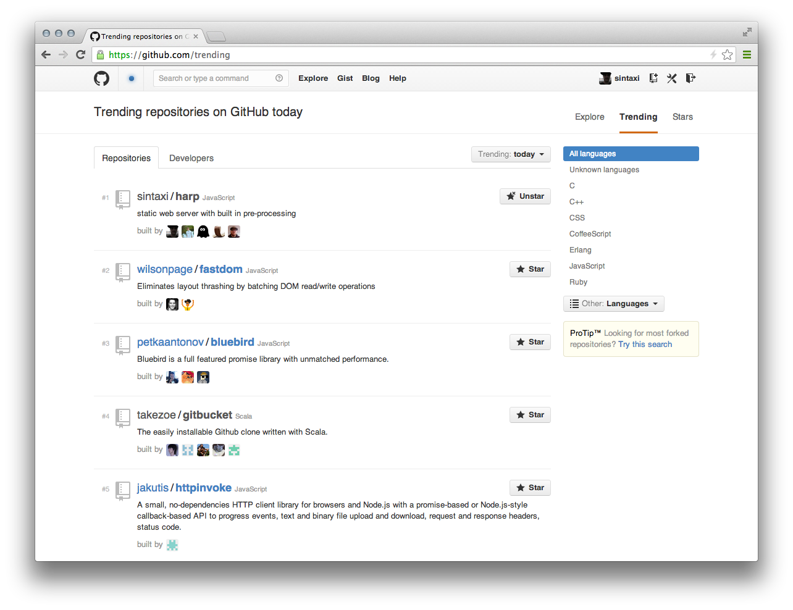
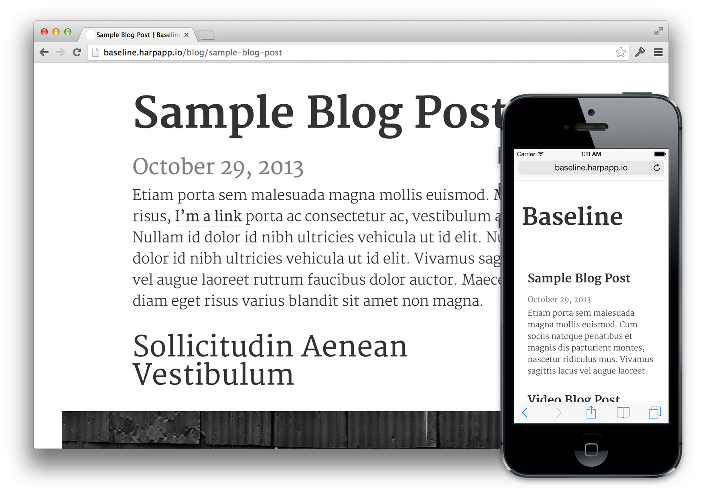
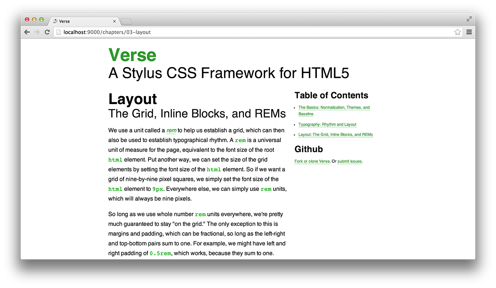

# Harp Weekly – #1 on GitHub

Since Sintaxi wrote [Introducing Harp](http://sintaxi.com/introducing-harp) a few weeks ago, we’ve seen a lot of people enjoy building things with it. Starting today, each week or so we’ll collect what’s new surrounding Harp—blog posts, sites, apps and community projects—and feature them here.

To get more frequent updates, follow Harp on Twitter [here](http://twitter.com/harpwebserver).

## #1 Trending Repo on Github!

Thanks to everyone who starred and watched [Harp on GitHub](https://github.com/sintaxi/harp). Harp had a great stint as the top trending repo.

## Boilerplates

### [Baseline](https://github.com/rosshj/baseline)

This stunning, long-form, blog boilerplate was created by [Ross Howard-Jones](https://twitter.com/rosshj).

## Blog Posts

### [Moving from dynamic to static with Harp](http://www.raymondcamden.com/index.cfm/2013/10/22/Moving-from-dynamic-to-static-with-Harp)

> I cut my teeth as a web developer building dynamic web sites, but more and more lately I'm finding that I don't need to do as much on the server. In fact, in some cases I don't need a back end server at all.
> **Raymond Carver**

From here, Raymond covers over converting an old site of his into a Harp app, and then deploying it to Amazon S3.

### [Adding Teasers and Tags for Posts with Harp](http://echaozh.com/posts/teasers-and-tags.html)

> Let's add support for WordPress style teasers: teaser and the rest of the content separated by a `<!-- more -->` comment.

A useful post from echaozh, covering one way to create excerpts and tags for a blog built with Harp.

### [Starting up with Jade](http://kevin.saliou.name/posts/2013-10-11-getting-started-with-jade.html)

Kevin Saliou has written a number of posts involving Harp, including this overview of converting a Bootstrap example from HTML to Jade.

## Projects

### [Doc-n-TOC](https://github.com/wballard/doc-n-toc)

Doc-n-TOC can generate a documentation site with a proper table of contents from your Markdown files. It’s using Harp to preprocess Markdown, Jade & LESS.

### [Verse](https://github.com/pandastrike/verse)

Verse, a forward-looking Stylus CSS framework, is using Harp to preprocess Markdown, Jade and, of course, Stylus.

## Next Harp Weekly

Subscribe to [our occasional newsletter](http://harpjs.us7.list-manage1.com/subscribe?u=af92eba03471187c8aa0266e7&id=74381fea66) to get the next <cite>Harp Weekly</cite> emailed to you. And, if you’re building something with Harp, reply to [@HarpWebServer](http://twitter.com/harpwebserver). We’d love to see what you’re working on—especially if you’re on Windows, as [Harp has Windows support as of v0.9.4](http://localhost:9000/blog/v0-9-4-windows-support).