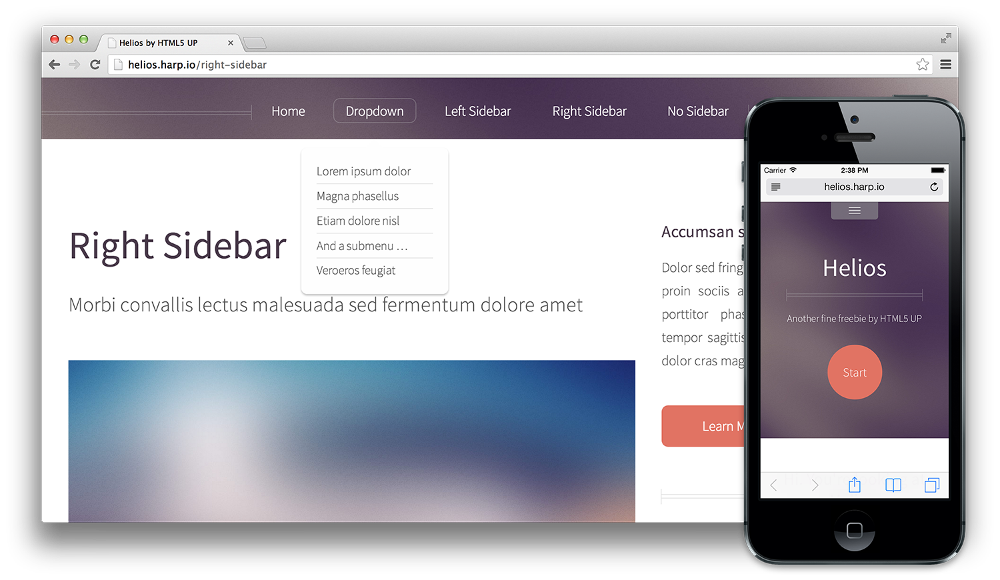

# Harp Weekly – HTML5 Up Boilerplates

If you’re looking to make something new with Harp, Rob Ellis has given you a good head start this week. He has converted fifteen of [HTML5Up’s](http://html5up.net/) templates [into Harp boilerplates](https://github.com/search?q=%40silentrob+hb-)!

## Boilerplates

### [HTML5UP Boilerplates](https://github.com/search?q=%40silentrob+hb-)

On top of the wide range of options, they now all use layouts, partials and EJS. There’s plenty of jumping off points here if you’ve been looking to get started customising a Harp application.

<ul class="col-12 col-lg-6">
<li>[hb-arcana](https://github.com/silentrob/hb-arcana)</li>
<li>[hb-astral](https://github.com/silentrob/hb-astral)</li>
<li>[hb-helios](https://github.com/silentrob/hb-helios)</li>
<li>[hb-prologue](https://github.com/silentrob/hb-prologue)</li>
<li>[hb-txt](https://github.com/silentrob/hb-txt)</li>
<li>[hb-zerofour](https://github.com/silentrob/hb-zerofour)</li>
<li>[hb-telephasic](https://github.com/silentrob/hb-telephasic)</li>
<li>[hb-verti](https://github.com/silentrob/hbverti)</li>
</ul>
<ul class="col-12 col-lg-6">
<li>[hb-parallelism](https://github.com/silentrob/hb-parallelism)</li>
<li>[hb-halcyonic](https://github.com/silentrob/hb-halcyonic)</li>
<li>[hb-dopetrope](https://github.com/silentrob/hb-dopetrope)</li>
<li>[hb-miniport](https://github.com/silentrob/hb-miniport)</li>
<li>[hb-minimaxing](https://github.com/silentrob/hb-minimaxing)</li>
<li>[hb-strongly-typed](https://github.com/silentrob/hb-strongly-typed)</li>
<li>[hb-escape-velocity](https://github.com/silentrob/hb-escape-velocity)</li>
<li>[View them all…](https://github.com/search?q=%40silentrob+hb-)
</ul>

## Blog Posts

### [Turn the switch to Harp](https://techlux.de/blog/2013/10/28/turn-the-switch-to-harpjs/)

Here, Marcel Fuhrmann writes in German about preprocessing and the no-backend movement.

### [Create a `sitemap.xml` with Harp](http://kevin.saliou.name/posts/2013-10-28-harpjs-adding-a-sitemap.html)

Kevin Saliou has written another useful post about how he’s customised [Sintaxi’s sitemap mixin](https://gist.github.com/jorgepedret/7160052#comment-936698) for his own needs.

## GitHub Issues

This past week, there’s been some good discussions around feature requests on [Harp’s GitHub issues page](https://github.com/sintaxi/harp/issues). It’s been really helpful to read about how people are using Harp—if you’re interested in getting more involved, [joining in on a discussion there](https://github.com/sintaxi/harp/issues).

## Next Harp Weekly

Subscribe to [our occasional newsletter](http://harpjs.us7.list-manage1.com/subscribe?u=af92eba03471187c8aa0266e7&id=74381fea66) to get the next <cite>Harp Weekly</cite> emailed to you. And, if you’re building something with Harp, reply to [@HarpWebServer](http://twitter.com/harpwebserver).