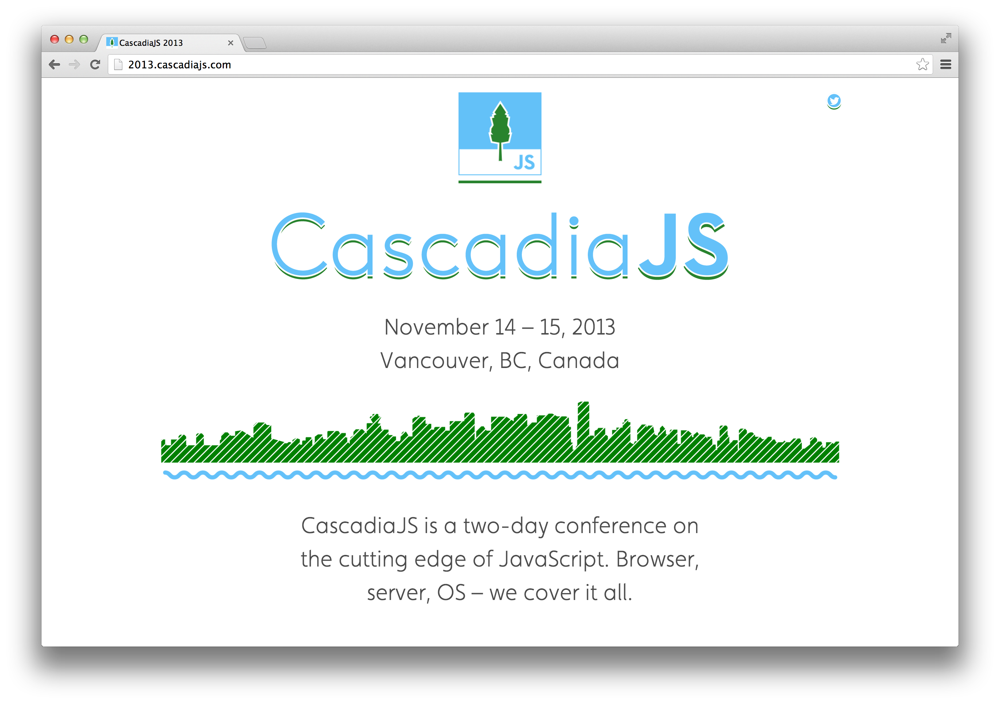
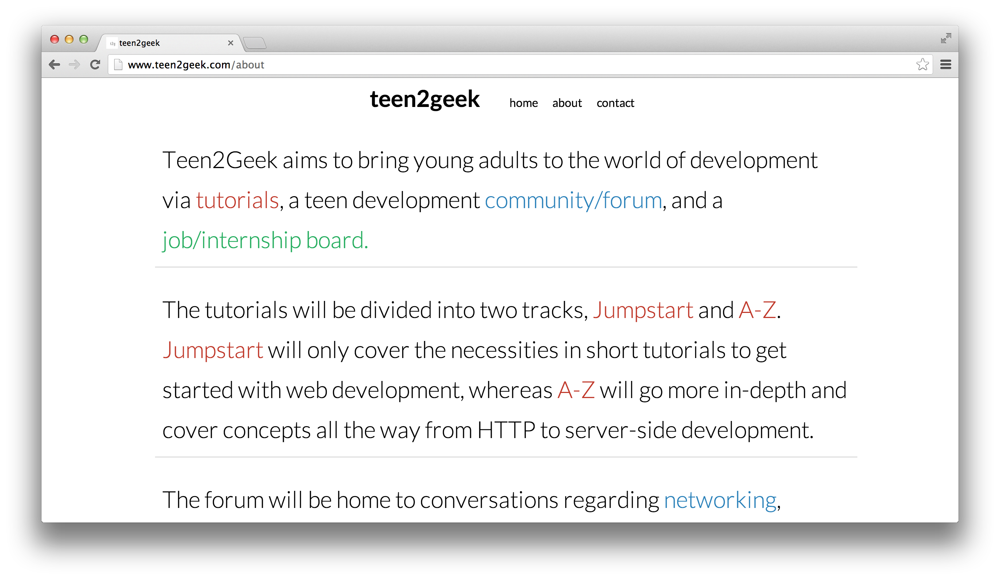

# Harp Weekly – The Week’s Workflow

This week, an entire workflow has been documented: upgrade from Jekyll to Harp with a new npm module, learn about some of Harp’s features in a podcast, and deploy your app with a new guide.

## Projects

### [jekyll2harp](https://npmjs.org/package/jekyll2harp)

Eric Drechsel has done a great job creating an npm module to help you upgrade from Jekyll to Harp. It safely moves YAML metadata into `_data.json`, among other things. If you’d like to contribute or find out more, the view [the GitHub repo for jekyll2harp](https://github.com/edrex/jekyll2harp).

### [CascadiaJS](http://2013.cascadiajs.com/)

This November 14th and 15th is CascadiaJS, a conference on the cutting edge of JavaScript. CascadiaJS’ site is built with Harp, and is published on the [Harp Platform](http://harp.io). This year, the event is taking place in Vancouver, BC. [Sintaxi](http://sintaxi.com/introducing-harp), the author of Harp, will be there—make sure to say “Hello” if you’re attending!

### [Teen2Geek redesign](http://www.teen2geek.com/)

Krish Dholakiya recently worked on the redesign for Teen2Geek, which aims to introduce young adults to web development. You can also see it on [Krish’s personal site](http://krrishd.github.io/); it’s built using Harp and [AngularJS](http://angularjs.org), which work great together.

## Posts & Podcasts

### [Topic Undefined #6 – Moving from Dynamic to Static with Harp](http://flippinawesome.org/topic-undefined/topic-undefined-episode-6/)

Raymond Camden and Brian Rinaldi talk about upgrading a dynamic site with Harp in the sixth episode of <cite>Topic Undefined</cite>.

### [Deploy a Harp application to OpenShift](https://www.openshift.com/blogs/day-8-harp-the-modern-static-web-server)

OpenShift, Red Hat’s cloud platform, is covering some of their favourite web development tools this month. On Day 8, they wrote about how to deploy a Harp application to OpenShift.

## Next Harp Weekly

Each week, I try and collect what people have been building with Harp. Follow and message [@HarpWebServer](http://twitter.com/harpwebserver) if you’re making something with it. We’ll happily include it in next week’s post!

Also consider subscribe to [our occasional newsletter](http://harpjs.us7.list-manage1.com/subscribe?u=af92eba03471187c8aa0266e7&id=74381fea66) to get <cite>Harp Weekly</cite> emailed to you.