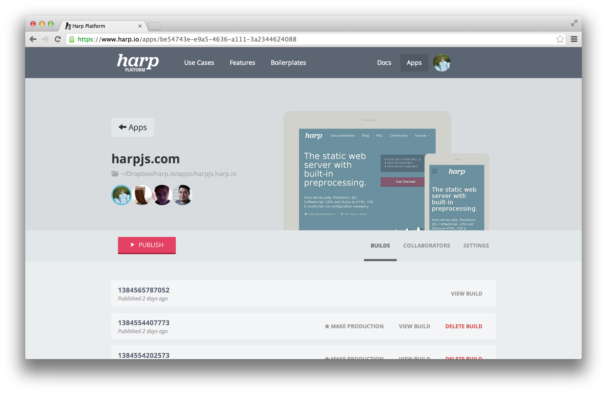
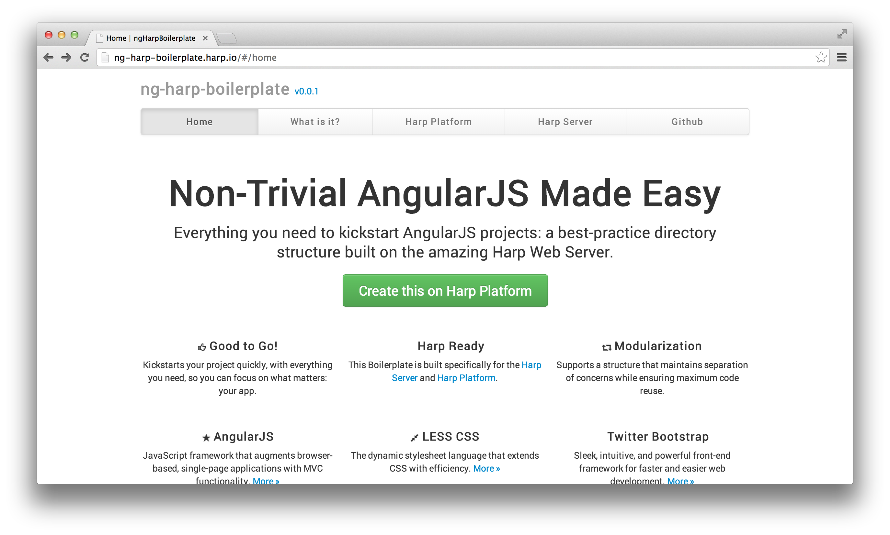

# Harp Weekly – Harp v0.10.0 & Harp Platform is open

## Harp v0.10.0

[Harp v0.10.0](http://harpjs.com/blog/v0-10-0-200-catch-all) was released last week, making Harp even better for developers working on client-side applications. If you’re using  AngularJS, Backbone, Ember.js, or a similar library, Harp v0.10.0 is for you. [Read more about the new version here.](http://harpjs.com/blog/v0-10-0-200-catch-all)

Update or install Harp using `npm install harp -g`. You may need to use `sudo npm install harp -g` depending on your system.

This release also introduced an API change that is a one-character fix, but will impact your application if it iterates over `_data.json` metadata. More details are in [the v0.10.0 release post](http://harpjs.com/blog/v0-10-0-200-catch-all).

## Harp Platform is now open

[Harp Platform](http://www.harp.io) is a front-end publishing platform powered by Harp and integrated with Dropbox. It’s also where this blog is hosted. Now, anyone can signup, create and publish Harp applications on Harp Platform, and edit and develop them right in their Dropbox. Read more in [the introductory blog post](http://blog.harp.io/posts/harp-platform-now-public).

Harp Platform uses a number of other open source libraries in addition to [Harp](https://github.com/sintaxi/harp): [Terraform](https://github.com/sintaxi/terraform) (Harp’s asset pipeline, and layout/partial engine), [Dbox](https://github.com/sintaxi/node-dbox) (A wrapper around the Dropbox API), [Thug](https://github.com/sintaxi/thug), [Waterfront](https://github.com/sintaxi/waterfront), and [Rolodex](https://github.com/sintaxi/node-rolodex).

## Publish Anywhere

Harp Platform makes it easy to publish Harp applications, but where and how you deploy your application is completely up to you. There are guides available for deploying Harp applications to [GitHub Pages](http://harpjs.com/docs/deployment/github-pages), [Heroku](http://harpjs.com/docs/deployment/heroku), and [Open Shift](https://www.openshift.com/blogs/day-8-harp-the-modern-static-web-server) with more to come.

 There are guides available for deploying Harp apps to GitHub Pages, Heroku, and Open Shift, with more to come.

## Harp with AngularJS & Bootstrap Boilerplates

[Rob Ellis](github.com/silentrob) has turned some more popular starting points into Harp boilerplates. The [HTML5 Boilerplate with Bootstrap](https://github.com/silentrob/hb-html5-boilerplate) is a great starting point for a website, as is the [Harp & AngularJS boilerplate](https://github.com/silentrob/hbp-ng-harp-boilerplate) for a client-side application.

## Harp mentioned in Mozilla WebFWD’s Alumni Update

Harp is a [Mozilla WebFWD](https://webfwd.org/) graduate, and [was mentioned](http://blog.webfwd.org/post/66288792540/alumni-updates) alongside the Harp Platform in a post on the WebFWD blog this week. Harp was originally demoed during Mozilla WebFWD. We’re very grateful for the continuing support from our friends at Mozilla.

## Next <cite>Harp Weekly</cite>

Thanks for reading <cite>Harp Weekly</cite>. Subscribe to [our occasional newsletter](http://harpjs.us7.list-manage1.com/subscribe?u=af92eba03471187c8aa0266e7&id=74381fea66) to get the next edition emailed to you. Follow Harp on Twitter at [@HarpWebServer](http://twitter.com/harpwebserver), and reply to us if you’re building something with Harp!