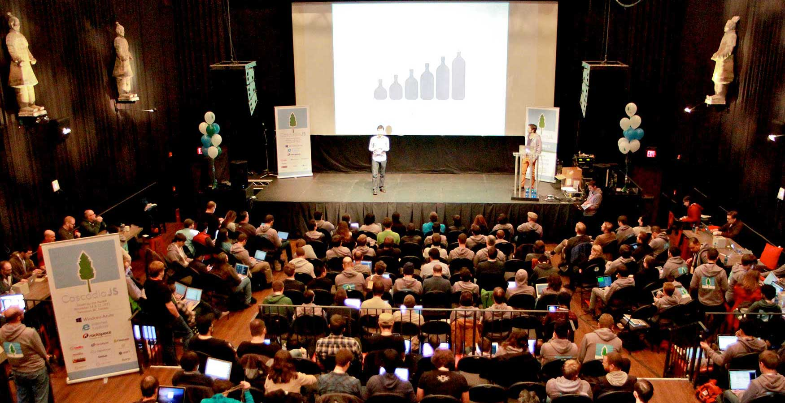

# Harp Weekly – WordPress to Harp

If you’re looking to upgrade a WordPress site to Harp, this would be a great week. A new script will help you migrate your data, the Harp blog boilerplate now supports Disqus comments by default, and there’s a new guide to using tags with static posts.

## Harp v0.10.1

Harp received [a minor update](https://github.com/sintaxi/harp/releases/tag/v0.10.1) this week, which adds LESS 1.5.1. Update using `npm install harp -g`, using `sudo` if necessary.

## Harp at RubyConf Argentina

[Brock Whitten](http://twitter.com/sintaxi), author of Harp, will be speaking about Harp and the [Harp Platform](https://www.harp.io) at [RubyConf Argentina](http://rubyconfargentina.org/en/). The event takes place in Buenos Aires, November 27th and 28th. If you’re attending, make sure to reply to [@sintaxi](http://twitter.com/sintaxi) and let him know.

## WordPress to Harp

Ethan Eldridge has created a script to prepare [WordPress’ JSON for Harp](https://github.com/EJEHardenberg/wpJson4Harp). If you’re looking to upgrade a WordPress site to Harp, this looks like an efficient way to migrate your posts and metadata.

Ethan has already added features since starting the project last week. WPJSON4Harp joins [Jekyll2Harp](https://github.com/edrex/jekyll2harp) on the list of easy-upgrade tools.

## Comments and tags

Jordan Cauley has updated [the default Blog boilerplate](https://github.com/harp-boilerplates/hb-blog) to support Disqus commenting. It, [Baseline](https://github.com/rosshj/baseline), and [Remedy](https://github.com/kennethormandy/hb-remedy) all support commenting just by adding your Disqus key to the `harp.json` file.

If you’re looking to add tagging to your blog in addition to commenting, Hauke Wesselmann has written a post about [adding a simple tag cloud to a Harp-based blog](http://www.h-dawg.de/posts/adding-a-simple-tag-cloud). I’ve seen this done client-side with a reasonable fallback; it’s great that Hauke is looking into ways of doing this on the web server side. He’s also experimenting with using Harp to create a FirefoxOS application!

## Outsider introduces Harp

[Outsider has written an article introducing Harp](http://blog.outsider.ne.kr/999) in Korean. It discusses some of Harp’s main features and how they can make your project more manageable.

## CascadiaJS 2013

[CascadiaJS](http://2013.cascadiajs.com/) is a two-day conference on the cutting edge of JavaScript, recently took place in Vancouver. Their site is built using Harp, and [videos of all the talks](http://2013.cascadiajs.com/videos) are now online! It was a fantastic event, and a pleasure to meet new people using Harp during it.

Some fun projects also came out of CascadiaJS’ Hacker Olympics, including a [Harp application by Chris Nicola](http://chrisnicola.harp.io/password/) that logs your voice to the console.

## Next Harp Weekly

There’s a great new release of Harp coming soon. Make sure to follow [@HarpWebServer](http://twitter.com/harpwebserver) or [watch Harp on GitHub](http://github.com/sintaxi/harp) to be notified first. Or, [subscribe to Harp Weekly](http://harpjs.us7.list-manage1.com/subscribe?u=af92eba03471187c8aa0266e7&id=74381fea66) to get the next edition emailed to you.