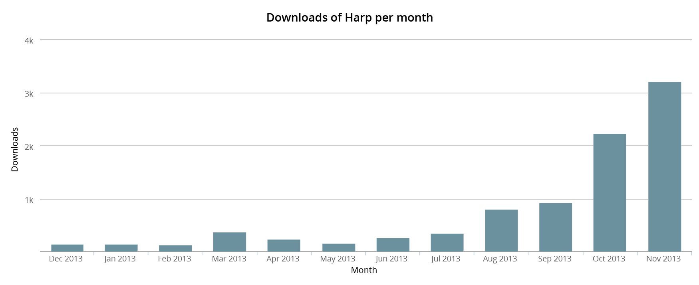

# Harp Weekly – 3,000 downloads in November

While we’ve been working Harp, many developers and designers are using Harp projects and putting it into production. This lead to well over 3,000 downloads of Harp [through npm](https://npmjs.org/package/harp) this month—thanks you to everyone who’s been trying it out!

<figure>

<figcaption>
[source: npm-stat](http://npm-stat.vorba.ch/charts.html?package=harp)
</figcaption>
</figure>

## Grunt Harp

If you’re already using tools like Grunt, you can still get the benefit of Harp’s zero-configuration preprocessing. Salehen Rahman [has put together a Grunt task](https://github.com/shovon/grunt-harp) you can use to serve or compile your project with Harp.

## Harp Powered

Ross Howard-Jones, creator of the [Baseline](https://github.com/rosshj/baseline) boilerplate for Harp, [wrote a post](http://www.wanderedoff.com/blog/harp-powered) about migrating a blog to Harp and hosting it on the [Harp Platform](https://www.harp.io). If you’re looking to add to your static blog from your mobile device, his workflow might be particularly interesting to you.

## Harp apps on Nginx

Harp is a static web server, but by running `harp compile`, you can flatten your preprocessed code into HTML, CSS & JavaScript and run it on another server. Coder’s Grid put together a guide on doing exactly that: [create a Harp application and deploy it to an Nginx server](http://www.codersgrid.com/2013/10/14/make-a-blog-with-harp/).

## Next Harp Weekly

There’s a great new release of Harp coming very soon. Make sure to follow [@HarpWebServer](http://twitter.com/harpwebserver) or [watch Harp on GitHub](http://github.com/sintaxi/harp) to be notified first. [Subscribe to <cite>Harp Weekly</cite>](http://harpjs.us7.list-manage1.com/subscribe?u=af92eba03471187c8aa0266e7&id=74381fea66) to get the next edition emailed to you.