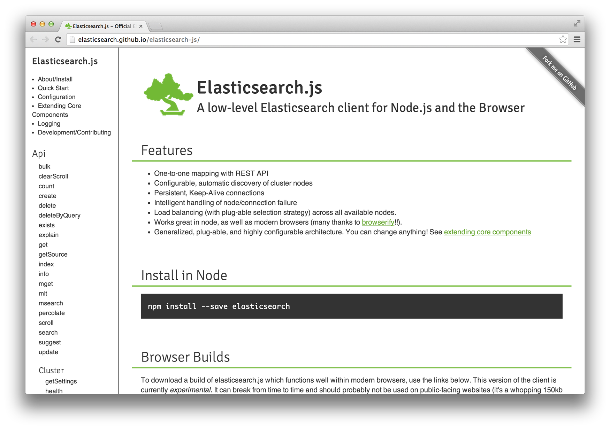

# Harp Weekly – Collect and Connect

Each <cite>Harp Weekly</cite> collects articles, tutorials, and successful community projects, for designers and developers building static sites and client-side applications.

## Elasticsearch is using Harp

Spencer Alger has released [Elasticsearch.js](http://elasticsearch.github.io/elasticsearch-js/), the official Elasticsearch client library for Node.js and the browser. The  documentation site looks thorough, and it was put together using Harp.

## Terraform Connect

This week, I was also shown C J Silverio’s [terraform-connect](https://github.com/lyveminds/terraform-connect), a variant of Terraform—Harp’s asset pipeline. This allows you to run Terraform as middleware, just [as you might with Harp](http://harpjs.com/docs/environment/lib).

## EJS documentation

[Harp’s documentation for EJS](http://harpjs.com/docs/development/ejs) improved this week. Did you know? To create an `.xml` file instead of the default of `.html` using EJS, all you need to do is rename it with a `.xml.ejs` extension? This works in [Jade](http://harpjs.com/docs/development/jade), too: `.xml.jade`. You can put this to good use by taking a look at how to build an RSS feed in the Harp Recipes section.

## Harp’s Stack Overflow tag

If you are having trouble with Harp, you’re more than welcome to [open an issue on GitHub](https://github.com/sintaxi/harp/issues)—but maybe the question has more to do with Jade, for example. [Harp now has its own tag on Stack Overflow](http://stackoverflow.com/questions/tagged/harp) so, if you’d like, you can also tag your questions with “Harp” and get help from the friendly people of both communities. Ask away!

## Toys for Static Sites

Raymond Camden writes for <cite>Flippin’ Awesome</cite> about building static sites with dynamic features like comments, calendars, and contact forms. This is a great collection of resources and services that work well with Harp and [the Harp Platform](http://harp.io). Take a look at the article, [Moving to static and keeping your toys](http://flippinawesome.org/2013/12/16/moving-to-static-and-keeping-your-toys/).

## Next Harp Weekly

[Subscribe to <cite>Harp Weekly</cite>](http://harpjs.us7.list-manage1.com/subscribe?u=af92eba03471187c8aa0266e7&id=74381fea66) so you don’t miss the next edition—I think you’ll like what we have to share. You can also follow [@HarpWebServer](http://twitter.com/harpwebserver) on Twitter.