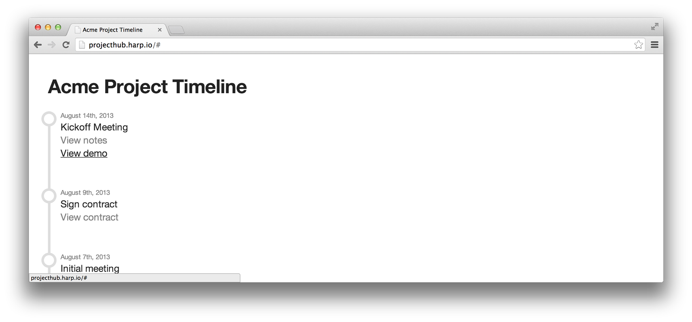

# Harp Weekly – Project Hubs with Harp

Each Harp Weekly includes helpful resources for creating static sites and client-side applications with Harp, the open source web server with built-in preprocessing.

## Brad Frost’s Project Hub and Harp

Brad Frost wrote a superb article for <cite>24 ways</cite> on [creating a home base for design projects](http://24ways.org/2013/project-hubs/). It included an an HTML template which Jorge Pedret has built upon using Harp.

[This new Harp template](http://jorgepedret.com/posts/harp-project-hub) serves as a centralised home base for your projects, making it easy to keep track of events and notes from the whole team. The project is still served as static HTML, but with Harp’s preprocessing and flexible metadata, it’s more maintainable. Jorge wanted to

> …demonstrate how easy it is to port any static template to Harp. It took less than 1 hour from start to end, including adding the instructions, updating the README file, making it dynamic, etc.
> __Jorge Pedret, [Project Hub: A new Harp template to track project timelines](http://jorgepedret.com/posts/harp-project-hub)__

### Launch a Project Hub through GitHub

There’s a a link to the Harp project [from Brad’s original on GitHub](https://github.com/bradfrost/project-hub#resources); it’s [ready to be cloned](https://github.com/jorgepedret/harp-project-hub) and run it locally with Harp.

### Launch a Project Hub through Dropbox

You could also try out a Project Hub through the [Harp Platform](https://www.harp.io): a front-end publishing platform integrated with Dropbox, and powered by [Harp](http://github.com/sintaxi/harp). There’s a free trial, perfect for [launching a Project Hub right in your Dropbox, with a custom subdomain](https://harp.io/apps/new?boilerplate=jorgepedret/harp-project-hub).

Then, you can share the Dropbox folder with your whole team. Everyone can update it, and even include and publish the relevant resources along with it. Jorge put an active example at [projecthub.harp.io](http://projecthub.harp.io/) to give you an idea.

Thanks to [Brad Frost](https://twitter.com/brad_frost) for continuing to share [and write about](http://bradfrostweb.com/blog/) resources like this.

## Experiments with static categories

Raymond Camden previously wrote about [moving from dynamic to static with Harp](http://www.raymondcamden.com/index.cfm/2013/10/22/Moving-from-dynamic-to-static-with-Harp). If you’re looking to create categories for a blog, he has another helpful post out, [covering about some of his static experiments](http://www.raymondcamden.com/index.cfm/2014/1/2/Some-HarpJS-experiments-involving-categories).

## Markdown and Client-side syntax highlight

[Harp’s Markdown documentation page](http://harpjs.com/docs/development/markdown) will now be more helpful if you’re writing a blog with code samples, or creating a documentation site. A GitHub Flavoured Markdown walk through is included, showing you how to denote what language you are using, making it perfect for a client-side syntax highlighter.

## The `environment` variable

Harp’s `environment` variable makes it possible for a static site to behave differently depending on its context. [The new `environment` documentation](http://harpjs.com/docs/development/environment) has a simple example for altering your site, depending on whether or not Harp is in production.

## Next Harp Weekly

There’s a post coming soon about some powerful dynamic features you can create with `environment`, while still serving a static site. If you’re interested, it will be included in the next Harp Weekly—[subscribe here](http://harpjs.us7.list-manage1.com/subscribe?u=af92eba03471187c8aa0266e7&id=74381fea66).

[Harp gained Sass support](http://localhost:9000/blog/v0-11-0-sass-support) in the most recent release, and there should be another update very soon. Follow [@HarpWebServer](http://twitter.com/harpwebserver) on Twitter to be notified first.