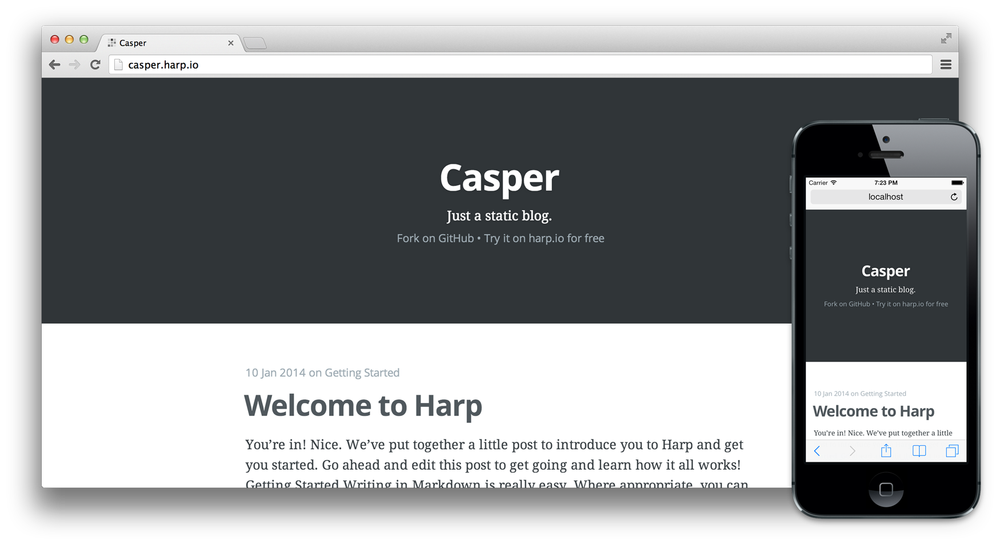
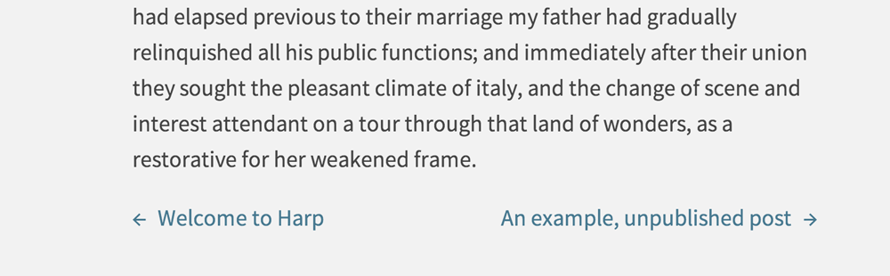

# Harp Weekly – Static Ghosts and Draft Posts

This edition of Harp Weekly used to be a draft. I wrote about how you can [create draft posts for your static blog](http://kennethormandy.com/journal/static-draft-posts-with-harp), too. Of course, it’s not a draft any longer, which means there’s more Harp links from this past week worth checking out.

## Ghost’s default theme as a static blog

In a decision that dramatically altered my sleep schedule for the remainder of the week, I decided to turn Ghost’s default theme into a boilerplate for Harp. This means you can now run Casper with no backend.

I’ve done my best to have it match the features currently available in Ghost. For example, you can create pages or posts, add custom header images, and modify the templates with [EJS](http://harpjs.com/docs/development/ejs) and the styles using [Sass](http://harpjs.com/docs/development/sass).

This boilerplate is a fork of the MIT Licensed [Casper](https://github.com/TryGhost/Casper); the the source code for the Harp version [is available on GitHub here.](https://github.com/kennethormandy/hb-casper)

## Build URLs on the Harp Platform

The Harp Platform, which allows you to publish static sites and client-side apps through Dropbox, introduced the Build URL feature, which allows you to see a previously published version of your site, served by Harp. [Find out more on the Harp Platform blog.](http://blog.harp.io/posts/feature-spotlight-build-urls)

## Synth, API first framework

Jon Abrams is working on [Synth](https://github.com/JonAbrams/synth), a <q>web framework for synthesizing API-first web apps that also have web front-ends.</q> It uses Harp for its preprocessing. Read more about it—appropriately—in [the project’s README](https://github.com/JonAbrams/synth).

## Harp all the things

Rob Ellis wrote about [moving his personal projects over to Harp](http://silentrob.me/articles/harp-app-the-things). If you’ve got a handful of projects with outdated codebases, it might be just the motivation you need to make them static.

## Recipe: Add Next / Previous links to blog posts

After a request on GitHub, the Harp boilerplates Baseline and Remedy both had next and previous post links added. Take a look at [the quick examples of how to add them](https://github.com/sintaxi/harp/issues/189); a more comprehensive recipe is coming soon.

## <cite>Flippin’ Awesome’s</cite> Best of JS2013

<cite>Flippin’ Awesome</cite> [included Harp among its Best of JavaScript](http://flippinawesome.org/2014/01/06/best-of-javascript-html-css-2013/) in 2013 list. There’s some great tools and patterns listed that work great with Harp, too: Cordova / PhoneGap 3.0, Backbone, Ember, Angular, React, and more.

## Next Harp Weekly

Next Harp Weekly will help you get ready for [Static Showdown](http://www.staticshowdown.com/), a 48 hour competition for creating static web apps. Harp would be the perfect tool to help with your entry.

Until then, follow [@HarpWebServer](http://twitter.com/harpwebserver) on Twitter for the latest.