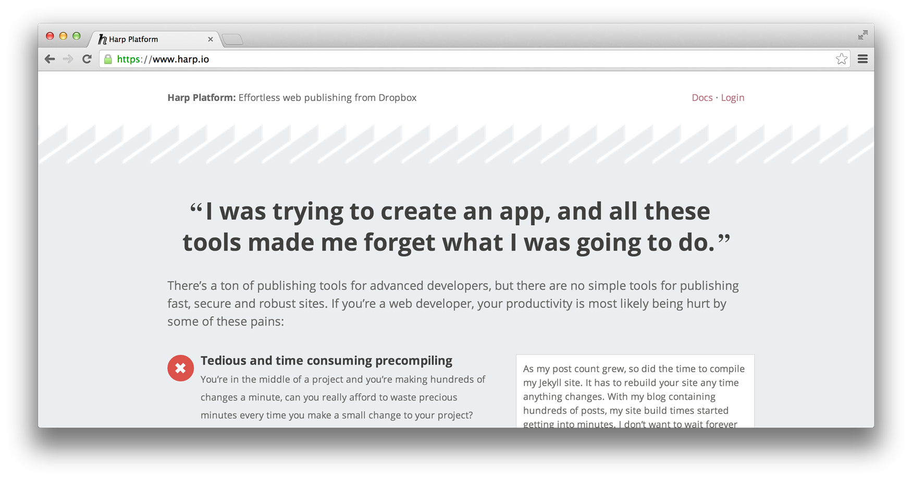

# Harp Weekly – Harp for Static Showdown

Each Harp Weekly collects helpful resources for creating static sites and client-side applications with Harp, the open source web server with built-in preprocessing.

## Static showdown

[Static Showdown](http://staticshowdown.com) is a “a worldwide 48 hour hackathon featuring static web apps.” If you’re familiar with Node Knockout, the concept is similar: you and your team have from midnight on February 8th GMT until the end of the 9th to build an app—without writing any backend code.

This means you could use [Hoodie](http://hood.ie/), [Kinvey](http://www.kinvey.com/), [Firebase](http://firebase.com/), [Parse](http://parse.com), or others, for your static app’s backend, as necessary. The front end could be handled by [Angular](http://angularjs.org), [Ember](http://emberjs.com), [Backbone](http://backbonejs.org) or any other front end framework of your choice! Harp will serve these applications, and take care of all the preprocessing for you.

As one Static Showdown entrant put it,

> @HarpWebServer + @angularjs + localStorage + @goinstant == @staticshowdown heaven

> __[Krish Dholakiya](https://twitter.com/krrishd/status/424685237650485248)__

Since your team will be on a time crunch, you might want to use a CSS framework or mixin library, too—[Harp works great with Foundation 5 or Bourbon](http://harpjs.com/blog/v0-11-0-sass-support).

### Rob Ellis judges Static Showdown

Rob Ellis, co-creator of Harp, also wrote about how the he will be representing the [Harp Platform by helping to judge Static Showdown](http://blog.harp.io/posts/static_showdown).

## Harp Platform Landing Page

The [Harp Platform](https://www.harp.io) provides effortless web publishing through Dropbox, and uses Harp in production so you get all the benefits of running it locally like [Clean URLs](https://www.harp.io/features/clean-urls) and [built-in preprocessing](https://www.harp.io/features/preprocessing).

The Harp Platform landing page got a great refresh this week, and now features some kind words by users of both Harp and the Harp Platform!

## Harp Buildpack for Heroku

If you’d like to deploy a Harp app to Heroku, there’s now a fantastic resource to help you, put together (appropriately) by Zeke Sikelianos of Heroku. The code [is available on GitHub](https://github.com/zeke/harp-buildpack).

### On Documentation

Some potential contributors to Harp have expressed interest in helping with the documentation, which we greatly appreciate. We will be open sourcing the docs in the very near future.

In the meantime, if you’d like to write about Harp—deploying a Harp application somewhere, using a preprocessor, or exploring advanced uses of some of Harp’s features, for example—we’ll make sure to promote your posts and link to them in the documentation!

To get the latest updates on Harp, follow [@HarpWebServer](http://twitter.com/harpwebserver) on Twitter.