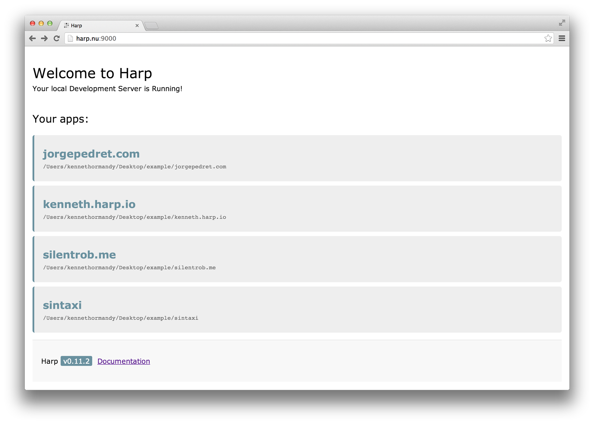

# Harp Weekly – Harp v0.11.2

A new version of Harp was released this week. Whether you using the [Harp Platform](https://www.harp.io) and Dropbox, keep  GitHub projects in one main directory, or use Harp as a headless web server, the latest version of Harp includes updates to Multihost that will be useful to you.

You can install this new version of Harp using:

```sh
sudo npm install -g harp
```

You may leave off `sudo` if you’re on Windows or already have admin privileges. If you’re new to Harp, [get started quickly here](http://harpjs.com/docs/quick-start).

## Harp v0.11.2 – Generic Multihost

Harp’s Multihost mode serves every subdirectory within the directory you specify. If you run `harp multihost` inside a folder, all the projects inside will be available in the browser as subdomains of `harp.nu`.

<figure>
  
</figure>

Once you run `harp multihost`, you can visit your local server in the browser (`localhost:9000` by default) and see the list of projects. Visiting any entry will take you to that project, served at a subdomain of `.harp.nu`. So, in this example, the `sintaxi/` directory would be available at `sintaxi.harp.nu:9000`. We’ll have more examples of how you can use [Multihost in the docs](http://harpjs.com/docs/environment/multihost) this week.

### All updates in v0.11.2

* Connect object now available when using [Harp as middleware](http://harpjs.com/docs/environment/lib) – [@sintaxi](https://github.com/sintaxi)
* Generic Multihost – [@silentrob](https://github.com/silentrob)
* [`harp init`](http://harpjs.com/docs/environment/init)’s default 404 page clarified – [@shovon](https://github.com/shovon)
* Failed compile properly errors, allowing testing with toolchains – [@remy](https://github.com/remy)

The especially curious may also [review the commit log](https://github.com/sintaxi/harp/compare/55af453...master).


## Static poetry

> _The expressions are learned, the cues hinted and stored<br/>We learn and predict and build the image of our affection_

> Ethan Joachim Eldridge

This week, the developer of the [WordPress to Harp script](https://github.com/EJEHardenberg/wpJson4Harp) wrote a post about a [poetry blog he started with Harp](http://ejehardenberg.github.io/blog/harp-and-smut).

## Banishing `.html` extensions

> With Harp, if you want your source content files to work as a static generated site, then you must refer to urls using `.html`.

> I don't like this.

> __Remy Sharp, [Harp Static](https://github.com/remy/harp-static)__

We love feedback! If you’re not using Harp to serve the sites you compile with it, presently, you may need to choose between a clean directory structure, and hard-coding `.html` in your links. ([There’s a GitHub issue discussion on this, too.](https://github.com/sintaxi/harp/issues/149))

In the meantime, Remy has put together [a pack called Harp Static](https://github.com/remy/harp-static), useful if you want a kind of strict mode, something witch Harp doesn’t have [right now](https://github.com/sintaxi/harp/issues/73#issuecomment-22827176).

Other solutions to this problem include:

* Publishing your site with the [Harp Platform](https://www.harp.io). It runs Harp in production, so you automatically get clean URLs, just like with `harp server`.
* Trying the Harp buildpack for Heroku, [featured in the previous edition of Harp Weekly](http://harpjs.com/blog/harp-weekly-2014-01-27).
* Using what Eric Drechsel developed: a small shell script that removes HTML extensions and [deploys your Harp project to Amazon S3](https://gist.github.com/edrex/7492725).

## Next Harp Weekly

The next edition of Harp Weekly will be right after [Static Showdown](http://harpjs.com/blog/harp-weekly-2014-01-27). Make sure to post how you’re using Harp; we’ll help share your  entry through [@HarpWebServer](http://twitter.com/harpwebserver) on Twitter.