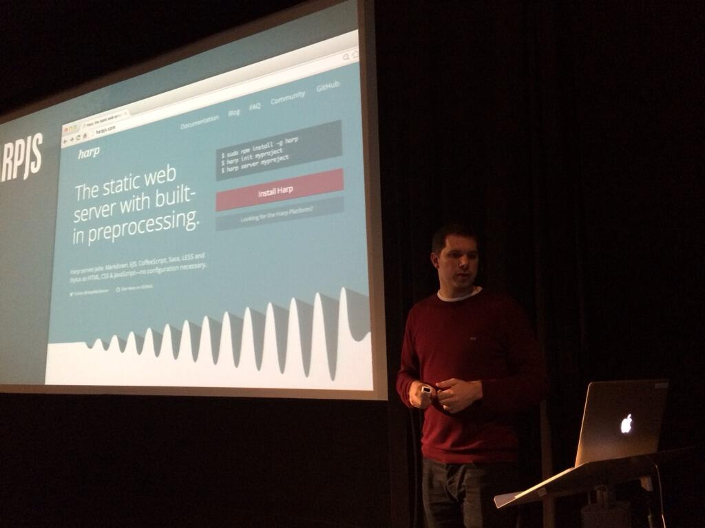
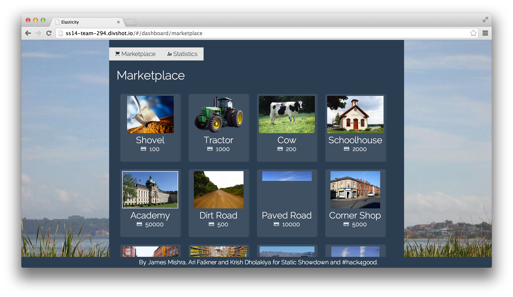

# Harp Weekly – Events and Calendars

Each <cite>Harp Weekly</cite> collects articles, tutorials, and community projects for designers and developers building static sites and client-side applications.

## Harp at the Acadiana Adobe User Group

[Raymond Camden](http://www.raymondcamden.com/index.cfm/2014/2/12/Presenting-on-Harpjs-next-week) is giving a talk on Harp at the [Acadiana Adobe User Group tomorrow](http://www.acadiana-aug.org/index.cfm/2014/2/4/New-Meeting-Place). The event is taking place from 6pm at The Switch, 100 Central St., Lafayette, LA, and will also be streamed online.

> Harp is great for building mobile web applications, blogs, docs, games, marketing sites, presentations. Pretty much anything with a front end. Ray Camden will give us an introduction to Harp, how easy it is to implement, and some cool demos.

If you’re not in LA, like us, you can [watch the live stream here](https://plus.google.com/u/0/events/c7do60050rpkhunbdquot2458ns).

## Dynamic Static Site Strategies at London JS Conf

Harp got a shout-out at [London JS Conf](http://londonjsconf.com/) this past week during Phil Hawksworth’s talk, Dynamic Static Site Strategies. [His slides are available here.](https://speakerdeck.com/philhawksworth/dynamic-static-site-strategies)

<figure>

<figcaption>[Photo via Remy Sharp](https://twitter.com/rem/status/433980367964749824)</figcaption>
</figure>

Make sure to [let us know](http://twitter.com/harpwebserver) if you’re hosting a meet up or speaking about Harp at an event so we can help share it!

## Add a Dynamic Calendar to a Harp site

In addition to his talk, Raymond has also been writing some great blog posts about using Harp, [including this one](http://www.raymondcamden.com/index.cfm/2014/2/14/Adding-a-dynamic-calendar-to-HarpJS), which shows you how to add a dynamic calendar to a static site. They’ll be especially useful if you’re using EJS.

## Libsass’ Plans

We keep a close eye on all the preprocessors that Harp supports. If you’re interested in finding out more about Libsass, the implantation of Sass that Harp uses, there’s [a discussion going on](https://github.com/hcatlin/libsass/issues/282) about how it will work towards parity with the Ruby version.

## Efficient Docker Containers using Nginx and Harp

Darron Froese wrote a blog post about compiling and deploying Harp sites through Docker. [You can read it here](http://blog.froese.org/2014/02/07/efficient-docker-containers-using-harp-and-nginx/), or check out the [resulting project on GitHub](https://github.com/darron/handbill-harp-nginx).

## Harp at Static Showdown

Congratulations to everyone who participated in [Static Showdown](http://staticshowdown.com), it was a fun event. Harp did well there, too: Rob Ellis from the [Harp Platform](https://www.harp.io) was a judge for the event, and contestants used Harp to help them build apps efficiently.

* [Elasticity](http://www.staticshowdown.com/app/teams/040664d40c5561d0393026641ccead1a/entry) by Krish Dholakiya, James Mishra, and Ari Falkner
* [Recollect](http://www.staticshowdown.com/app/teams/bae25858d0acd07ae8f6e9a49d2944a5/entry) by Jorge Pedret and myself
* [Statiquote](http://www.staticshowdown.com/app/teams/c5aa71a306dbc323d235a00d90c96b76/entry) by Chris Thomas

Make sure to tag your entry with “Harp” if you used it, or let just let us know and we’ll highlight it in a future edition of Harp Weekly.

## Next Harp Weekly

There’s a new release of Harp coming soon, with some great contributions from the community. Make sure to follow [@HarpWebServer](http://twitter.com/harpwebserver) on Twitter to be notified first.