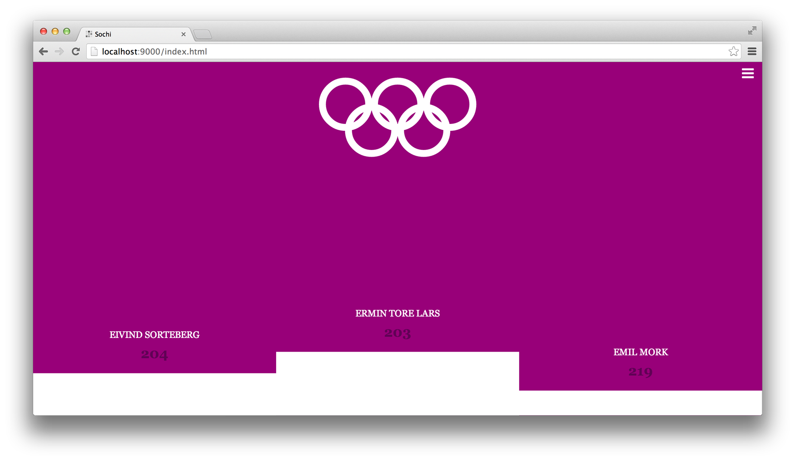
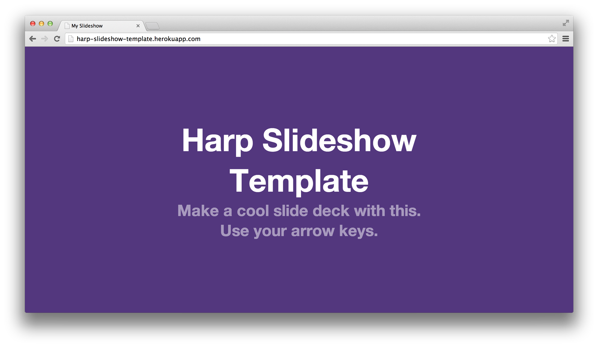

# Harp Weekly – Slides

Each Harp Weekly includes helpful resources for creating static sites and client-side applications with Harp, the open source web server with built-in preprocessing.

## Raymond’s talk

<figure>
<iframe src="http://www.youtube.com/embed/DPDq-E86IUE" frameborder="0" allowfullscreen style="width: 100%; min-height: 350px;"></iframe>
</figure>

Raymond Camden of Adobe presented on Harp this past week, and then again in this live screencast. It’s a great introduction to Harp and the [Harp Platform](https://harp.io/). He also has [more notes from his talk](http://www.raymondcamden.com/index.cfm/2014/2/21/Recording-and-Assets-from-my-Harpjs-Presentation) available. Consider sharing it with someone you think would enjoy trying out Harp!

## Sochi Harp app

Torgeir Thoresen used Harp to build [an Olympics standings app](https://github.com/torgeir/sochi-tipping), which includes some slick SVG animations.

## Harp Slideshow template

Zeke Sikelianos has put Harp to great use again with [this slideshow template](https://github.com/zeke/harp-slideshow-template), complete with Markdown, `iframe` embed, and code highlighting support.

If you’re considering giving a talk about Harp, static applications, preprocessors, or something else you think we might like, [get in touch](http://twitter.com/harpwebserver) and we’ll do our best to promote your talk or meet up.

## Next Harp Weekly

Another release of Harp is around the corner. If you’re interested in contributing to Harp, feel free to open or comment on [an issue on GitHub to get started](https://github.com/sintaxi/harp/issues).