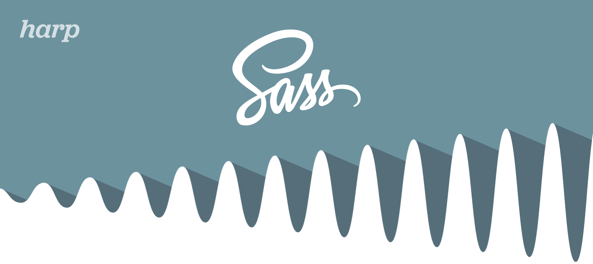
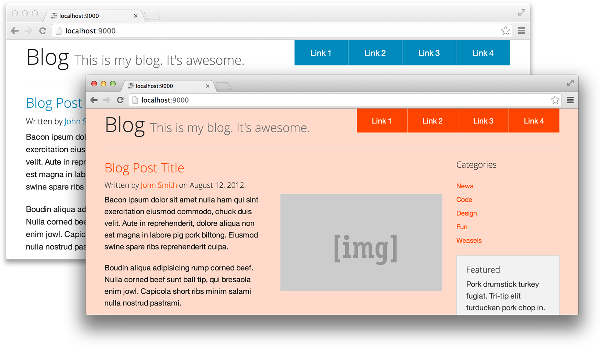
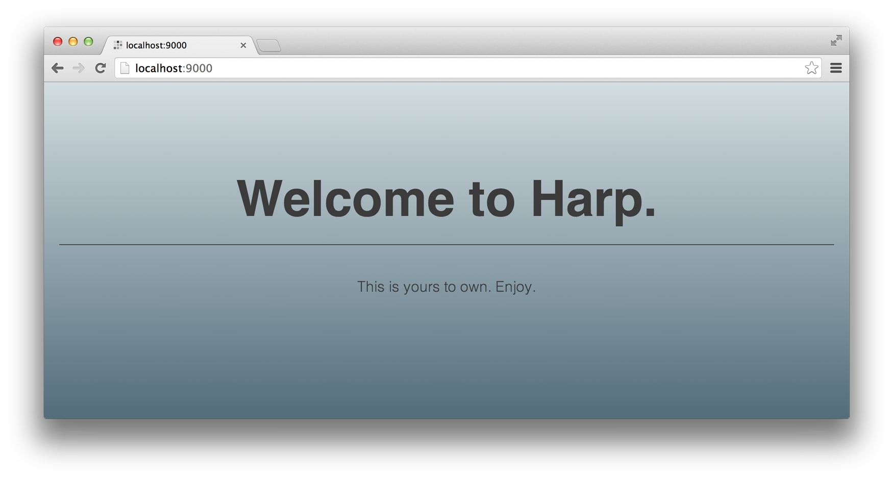

# Harp v0.11.0 – Sass support

With [Harp](https://github.com/sintaxi/harp), designers and developers don’t have to worry about configuring preprocessors; Harp implicitly serves Markdown, LESS, CoffeeScript, and more, as HTML, CSS, and JavaScript. Today, we’re happy to announce the most-requested addition to this list is ready to use: Harp now supports Sass!

Name a file `.scss`, and Harp will serve it as `.css`—there’s no setup necessary. This also makes Harp a great way to work with SCSS libraries like [Foundation 5](http://foundation.zurb.com) and [Bourbon](http://bourbon.io). This all happens incredibly fast as Harp is using [libsass](http://libsass.org), the C++ implementation of&nbsp;Sass.

<br/>



## Install Harp

To update or install Harp, run:

```bash
sudo npm install -g harp
```

You can leave off sudo if you are using Windows. Now that you’ve using Harp v0.11.0, the fun with Sass and Foundation starts.

## Using Sass

With Harp, you can create `.scss` files just as easily as `.css` files; there’s no configuration or setup required. For example, this is a `main.scss` file:

```scss
$bg: #6B919E;

body {
  background: $bg;
}
```

Now, in your template or HTML file, reference `main.css` as you would normally:

```html
<link href="main.css" type="text/css" rel="stylesheet">
```

## That’s it

Harp has already served the SCSS file as a compiled stylesheet. Make a change to `main.scss`, refresh, and the updates are already live. There’s no need to set input or output locations, and you never have the compiled, minified `main.css` file mixed in with your source files.

This makes using CSS frameworks with Harp especially appealing.

## Harp and Foundation 5

Harp makes Working with the Foundation 5’s SCSS easy. If you have used Harp with Bootstrap, then you know how powerful this is.

You can use [Component](http://component.io) to install Foundation into a new Harp app. We’ll be writing more about Component in the future, but for now, follow these instructions and you’ll be set.

```bash
sudo npm install -g harp
npm install -g component
```

### Create a new project

Try out Foundation 5 by creating a new project:

```bash
harp init myproject
cd myproject
mv main.less main.scss
component install harp/foundation
```

The default `.less` file has been renamed to `.scss`, and Foundation has been installed. In `main.scss`, you can import Foundation 5 as you would any other `.scss` file:

```scss
@import "components/harp-foundation/scss/foundation";
```

Now, just serve the project:

```bash
harp server
```

### Customising Foundation with Harp

Your project is now using Foundation—best of all, it’s using the source files. Just by changing a couple of variables or using some of Foundation’s mixins in `main.scss`, you can quickly make your project your own.



Here, I took [a Foundation template](http://foundation.zurb.com/templates.html) and pasted it into my `index.ejs` file. Then, I just changed some variables in my `main.scss` file:

```scss
// Variables
$primary-color: orangered;
$body-bg: lighten($primary-color, 40%);
$body-font-color: #111;

// Imports
@import "components/harp-foundation/scss/foundation";
```

## Harp with Bourbon & Neat

Harp works perfectly with Bourbon and its grid framework, [Neat](http://neat.bourbon.io). They can be installed similarly to Foundation, after installing Component and upgrading Harp.

```bash
component install harp/neat
```

Since Bourbon is a dependency of Neat, both are now installed in a `components` directory, ready to be referenced in your `main.scss` file:

```scss
@import "components/harp-bourbon/scss/bourbon";
@import "components/harp-neat/scss/neat";
```

Since you’re using the source files, you might even choose to import one portion of a library if the situation calls for it:

```scss
@import "components/harp-bourbon/scss/css3/linear-gradient";
```

### Using Bourbon

Either way, I can now use Bourbon’s linear-gradient mixin in my `main.scss` file:

```scss
html {
  height: 100%;
  @include linear-gradient(#D3DEE1, #6B919E);
}
```



<!-- 

## Harp with Compass Core

Normally, Compass requires Ruby, but I’ve broken out Compass Core, which doesn’t, into a Component for Harp. This means you can still use all of Compass’ vendor prefixing and helpers, without even needing to install Ruby, Sass or the Compass Gem.

Once Harp has been upgraded and Component installed, as with Foundation, Compass Core can be installed:

```bash
component install harp/compass
```

Compass Core is now installed in a `components` directory. Reference it in your `main.scss` file:

```scss
@import "components/harp-compass/scss/compass";
```

As far as I’m aware, this makes Harp the only project where you can use Compass (albeit a subset of it) alongside libsass. I’ll be doing my best to see how this could be even better in the future.

-->

## Other updates in v0.11.0

There were other important fixes and contributions from the community in this version of Harp. Thanks everyone!

* `harp init` file permissions were corrected, thanks to [Pablo Olmos de Aguilera Corradini](https://github.com/PaBLoX-CL)
* Harp now properly serves files with spaces in the name, thanks to [jekyll2harp author Eric Drechsel](https://github.com/edrex)
* Node-sass was added to Terraform, thanks to [Carlos Rodriguez](https://github.com/carlosrodriguez) for starting this, and to [Nick Schonning](https://github.com/nschonni) for preventing the binaries in [Node-sass](https://github.com/andrew/node-sass) from rebuilding

## On libsass

The C++ implementation of Sass, [libsass](http://libsass.org), was chosen over the Ruby version, to give Harp it’s SCSS preprocessing ability. This means your `.scss` files will turned into CSS incredibly quickly.

Libsass is not feature complete against Ruby Sass, but (as we’ve covered) many popular libraries are still supported. The most glaring missing feature, `@extends` support, is actively being worked on by the lead libsass developer and will be added to Harp once that work is complete.

## Ship Sass

Now that you’ve started your project with Foundation or Bourbon, you will need to get it online. Harp also helps power the [Harp Platform](https://www.harp.io), a front-end publishing platform integrated with Dropbox. It’s the fastest way to deploy your new Foundation or Bourbon project—you’ll never need to flatten your SCSS source files.

## Looking forward

Sass support opens up many new possibilities with Harp. We will be looking closer at libsass, Foundation, Bourbon, and more, all in future posts. [Subscribe to Harp Weekly](http://harpjs.us7.list-manage1.com/subscribe?u=af92eba03471187c8aa0266e7&id=74381fea66), or follow [@HarpWebServer](http://twitter.com/harpwebserver) on Twitter to be notified.