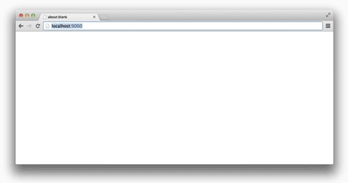

# Harp v0.11.1 – Basic Authentication support

If you need a fast way to limit access to an entire static site or client-side application, Harp v0.11.1 is for you.



## Install or Update Harp

If you haven’t tried Harp before, there is a [helpful getting started guide](http://harpjs.com/docs/quick-start). Otherwise, install or update Harp using:

```sh
sudo npm install -g harp
```

## Adding Basic Authentication

In your project’s `harp.json` or `_harp.json` file, adding the following line will password protect the entire Harp app:

```json
{
  "basicAuth": "Ali Baba:Open, Sesame!"
}
```

You may also specify multiple username and password combinations to authenticate against:

```json
{
  "basicAuth": ["user1:pass1", "user2:pass2", "user3:pass3"]
}
```

[Harp’s `basicAuth`](../docs/development/basicauth) has been added to the documentation, too.

## Harp and Brad Frost’s Project Hub

In the most recent edition of Harp Weekly, Brad Frost’s Project Hub was featured, originally introduced in his article for <cite>24 ways</cite>. He says a Project Hub

> consolidates all the key design and development materials onto a single webpage … (either publicly available or password protected), so that everyone involved in the team has easy access to it.
> __Brad Frost, [Project Hubs: A Home Base for Design Projects](http://24ways.org/2013/project-hubs/)__

With basic authentication, Harp is even better for Project Hubs, as you can quickly add password protection to an entire site needed. Jorge Pedret’s [Project Hub boilerplate for Harp](https://github.com/jorgepedret/harp-project-hub) is ready to support this; just update the `_harp.json` file.

## Other changes in Harp v0.11.1

### Preparing for `!!!`

There are no breaking changes in this release of Harp, but to try and avoid any inconveniences in the future, it would be a good idea to change `!!!` to `doctype` any Jade templates.

A change was made to Jade which no longer allows `!!!` in Jade, but we have decided not to update Harp to use this version of Jade yet. [We’re hoping to make this a smooth transition for anyone using Jade](https://github.com/visionmedia/jade/pull/1374), but if you’d like to avoid any potential issues, the safest approach would be to change `!!!` to `doctype` in your applications.

The `_layout.jade` file created by `harp init` now uses `doctype` instead of `!!!` to help mitigate this problem. If you have more questions about, [feel free to ask](http://harpjs.com/community).

## CLI Improvements

There were also some tweaks made to the CLI shown when you run `harp server`.

## Looking forward

Hope you enjoy Harp v0.11.1! The next version of Harp is already underway. [Subscribe to Harp Weekly](subscribe), or follow [@HarpWebServer](http://twitter.com/harpwebserver) on Twitter to be notified when it’s available.