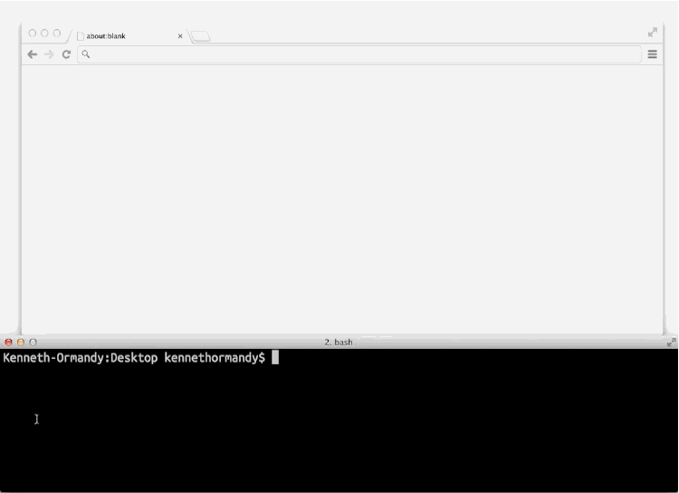

# Harp v0.12.1 – Boilerplate support

A new release of Harp is available, allowing you to initialise any new project with a boilerplate from GitHub.



## Boilerplates, `-b` for short

Thanks to [@zeke](http://github.com/zeke), `harp init` is a lot more powerful. Now, you can initialise any project on GitHub as a boilerplate for Harp. For example, if you wanted to get started with the [Remedy](http://github.com/kennethormandy/hb-remedy) boilerplate right from the command like, you can now run:

```bash
harp init --boilerplate kennethormandy/hb-remedy
# Downloading boilerplate: https://github.com/kennethormandy/hb-remedy
# Initialized project at /path/to/your/project
```

Or, use any of the default boilerplates in the [Harp Boilerplates](https://github.com/harp-boilerplates) repository without needing to specify a user name:

```bash
harp init --boilerplate hb-blog
# Downloading boilerplate: https://github.com/harp-boilerplates/hb-blog
# Initialized project at /path/to/your/project
```

There’s more details in the new documentation for [Initializing a Harp Application](http://harpjs.com/docs/environment/init).

## Multihost updated

Multihost is working better than ever thanks to [@silentrob](https://github.com/silentrob). If you have a folder full of Harp Applications or any static sites you’d like to serve, you can run `harp multihost` on the directory to serve them all at once.

```
harp multihost path/to/my-apps
# Harp is now serving multiple apps at http://harp.nu:9000
```

There’s more detailed instructions in the updated [Harp Multihost](http://harpjs.com/docs/environment/multihost) documentation.

## Installing the latest version

You can update to the latest version of Harp with:

```bash
npm update -g harp
```

You may need to use `sudo npm update -g harp` depending on your setup. If you haven’t installed Harp yet, get started with

```bash
npm install -g harp
```

and take a look at the [quick start guide](http://harpjs.com/docs/quick-start). Now, you’re ready to play with what’s new in Harp v0.12.1.

## Bugfixes

Many issues have been taken care of thanks to community contributions. Thanks to everyone who’s opened a an issue or pull request on [Harp](https://github.com/sintaxi/harp) or [Terraform](https://github.com/sintaxi/terraform)!

* Fixed BOM encoding issue for Markdown files, thanks to [@ryanlewis](https://github.com/ryanlewis)
* Clarified that Terraform is MIT licensed, thanks to [@108ium](https://github.com/108ium)
* Tested every preprocessor for special characters
* Properly allow dot characters in the filename, thanks to [@gadr](https://github.com/gard)

If you’re interested in getting helping contribute to Harp at any level, we’d be more than happy to have you. Just [open an issue on GitHub](https://github.com/sintaxi/harp) and we’ll get the discussion started.

## Preprocessors

Almost every preprocessor has been upgraded for this release of Harp.

* [EJS is now at version 1.0.0](https://github.com/visionmedia/ejs/blob/master/History.md#100--2014-03-24), which includes many minor fixes
* [Node-sass is now at version 0.8.4](https://github.com/andrew/node-sass/releases), which adds basic `@extends` support and other fixes that move libsass closer towards parity with Sass 3.2.
* [Stylus is now at version 0.42.3](https://github.com/LearnBoost/stylus/blob/master/History.md#0423--2014-03-03) with `blocks` support and more (similar to Sass’ `@extends`)
* [LESS is now at version 1.7.0](https://github.com/less/less.js/blob/master/CHANGELOG.md#170), which includes many fixes and some new features like added support for rulesets in variables and passed to mixins to allow wrapping