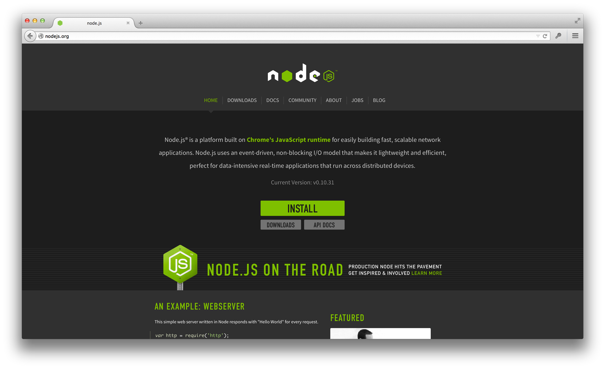

# Harp v0.13.0 – Upgrading Harp to Node v0.10.x

Harp v0.13.0 was recently released, which [includes the Sass indented syntax](v0-13-0-sass-indented-syntax-support). This preprocessor requires a more recent version of Node, which you may need to install.

If you are running Node v0.8.x or lower, you may be receiving an error message like this upon trying to instal Harp (but with a lot more lines):

```sh
npm WARN engine harp@0.13.0: wanted: {"node":">=0.10"} (current: {"node":"v0.8.26","npm":"1.2.30"})
…
npm ERR! not ok code 0
```

Upgrading to Node v0.10.x will solve the problem.

## Upgrading Node

First, check which version of Node you’re running:

```sh
node --version
```

If you get `v0.10.x` or higher (where `x` is any number), then you are ready. If you get `v0.8.x`, you will need to upgrade to the latest version of Node. Just visit [the Node website](http://nodejs.org), download, and install the latest version.

[](http://nodejs.org)

## Installing Harp

Now when you check Node’s version:

```sh
node --version
```

You should receive at least `v0.10.x` To install Harp, run:

```
npm install -g harp
```

You may need to use `sudo npm install -g harp` depending on your setup.

## What’s next?

Take a look at the release notes for [Harp v0.13.0](../v0-13-0-sass-indented-syntax-support) if you’re interested in playing with the new `.sass` indented syntax preprocessor, or review [Harp’s five simple rules](http://harpjs.com/docs/development/rules) and get started on your static site!