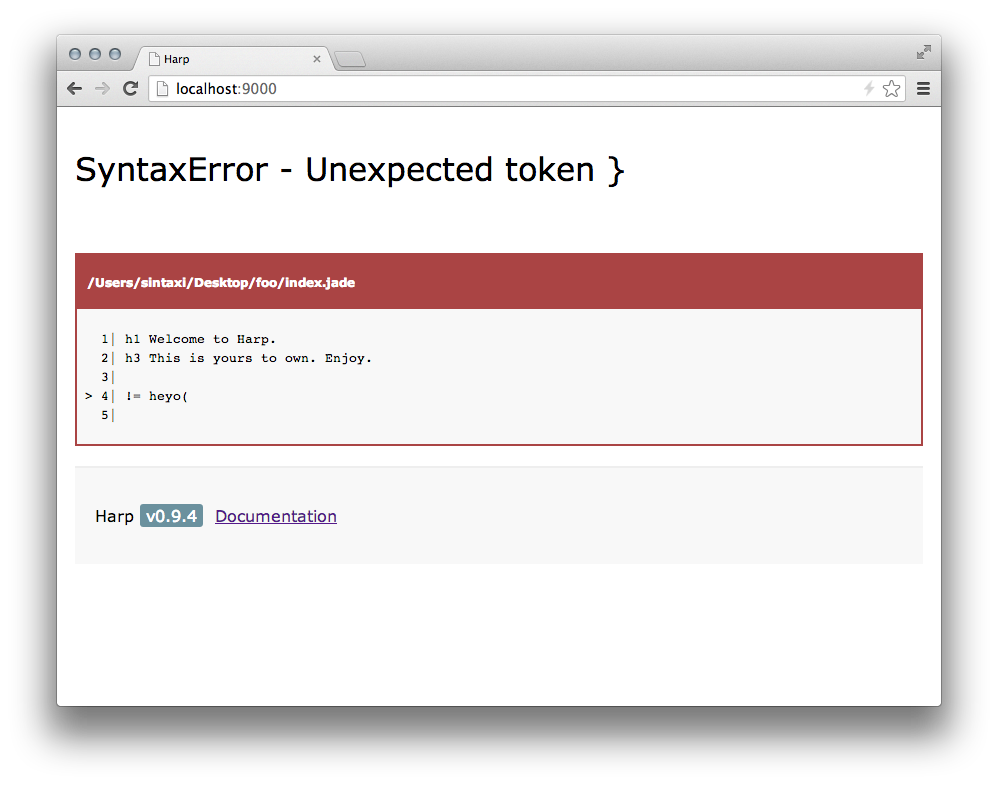

# Harp v0.9.4 – windows support

It&rsquo;s been over one month since v0.9.3 shipped and frankly this is too long. After Harp became the top tending repo on Github for a couple days I felt pressure to make v0.9.4 a solid release and this resulted in a delay. The next several releases will be more frequent.

Although it took longer than expected, [Harp v0.9.4](https://github.com/sintaxi/harp/releases/tag/v0.9.4) is a substantial improvement over v0.9.3. A boatload of bugs were fixed and I&rsquo;m happy to report Harp now works on Windows!

## Windows

Windows support was not an easy achievement. Although Node&rsquo;s windows support is superb, Harp has a lot of code paths that get hit by both URL paths (when running as a web server) and as file system paths (when compiling). This is pretty easy achievement on *nix systems as URLs and file paths match 1:1, on windows however it is a different story because URLs use forward slashes and the file system uses back slashes. This resulted in a lot of changes.

## Precompiler Upgrades

Nearly every precompiler was upgraded in this release. For now we are continue to upgrade whenever the precompilers get new releases. This may cause some minor breakage from time to time but we don&rsquo;t see this causing large problems (at least for now).

### Bug Fixes

Lots of bug fixes in this release, mostly around ensuring that headers are being set properly and Harp behaves as expected in regards to layout and partial rendering.

### Error Pages

We cut down the complexity our error pages for the sake of maintainablity and reliability. These error pages are important to the usability of Harp and we are striving to find the right balance of power and simplicity. Not sure if we are there yet, but cutting it down seemed like the right thing to do at this point.



### API Breakage

There are a couple minor things that changed as a result of upgrading Jade and LESS. Jade now expects `script.` and `style.` instead of `script` and `style`. For LESS changes view the [v1.4.x release notes](http://lesscss.org/#changes).

## How to Upgrade

Install or Upgrade with the following command...

```
sudo npm install harp -g
```

### Thanks

Thanks to all who have been reporting issues, writing blog posts, and helping people out in #harp IRC. In a very short time, Harp has developed a vibrant community.

## Whats Next?

- continued stability
- smarter redirects
- Sass support
- 200 fall-back page (for better Angular/Backbone)

[See the milestones for more details](https://github.com/sintaxi/harp/issues/milestones)
