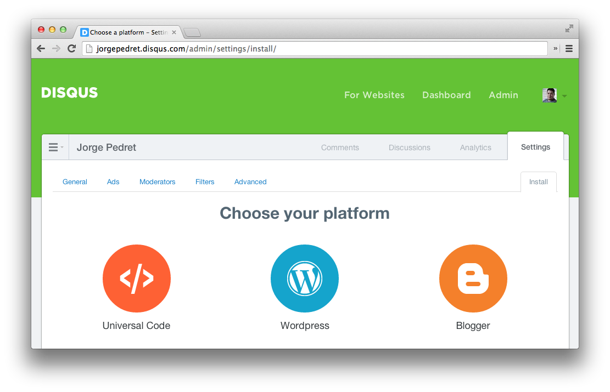

# How to add comments to blog posts

This recipe will show you how to add comments to your blog posts. There are multiple services that provide comments, for this recipe we’re going to use the popular service, [Disqus](http://disqus.com/).

## Overview

When you signup for  Disqus account, you receive a snippet of code to copy and paste into your Disqus gives you a snippet that you copy and paste to your app, then add a simple conditional to show it only when you are in the posts directory.

```
myapp/
  | _layout.jade or _layout.ejs
  + _comments.ejs
      posts/
        |- an-article-about-harp.md
        +- my-first-blog-post.md
```

1. The layout file will hold the logic that chooses to display or not to display the comments
2. The `_comments.ejs` file is where you’re going to paste the snippet that you get from Disqus

## Getting Disqus snippet

Before you can add comments to your posts, we need to get a copy/paste snippet from Disqus, so go to their [signup page](https://disqus.com/admin/signup/?utm_source=New-Site) and get your code from them. Select *Universal Code* to get a snippet that you can copy and paste to your app.



## Setup the comments partial

Take the snippet that you got from Disqus and paste it in the `_comments.ejs` file. Each snippet is unique to every customer, this is what mine looks like:

```ejs
<div id="disqus_thread"></div>
<script type="text/javascript">
    /* * * CONFIGURATION VARIABLES: EDIT BEFORE PASTING INTO YOUR WEBPAGE * * */
    var disqus_shortname = 'xyJdWXok9PGNCP6sXN'; // required: replace example with your forum shortname

    /* * * DON'T EDIT BELOW THIS LINE * * */
    (function() {
        var dsq = document.createElement('script'); dsq.type = 'text/javascript'; dsq.async = true;
        dsq.src = '//' + disqus_shortname + '.disqus.com/embed.js';
        (document.getElementsByTagName('head')[0] || document.getElementsByTagName('body')[0]).appendChild(dsq);
    })();
</script>
<noscript>Please enable JavaScript to view the <a href="http://disqus.com/?ref_noscript">comments powered by Disqus.</a></noscript>
<a href="http://disqus.com" class="dsq-brlink">comments powered by <span class="logo-disqus">Disqus</span></a>
```

## Setup the Layout file

This is where all the logic happens. We only need to show the comments when we are on one of the posts pages, this is how we do that:

### Using Jade

```jade
if current.path[0] == "posts"
  != partial("_comments")
```

### Using EJS

```ejs
<% if (current.path[0] == "posts") { %>
  <%- partial("_comments") %>
<% } %>
```