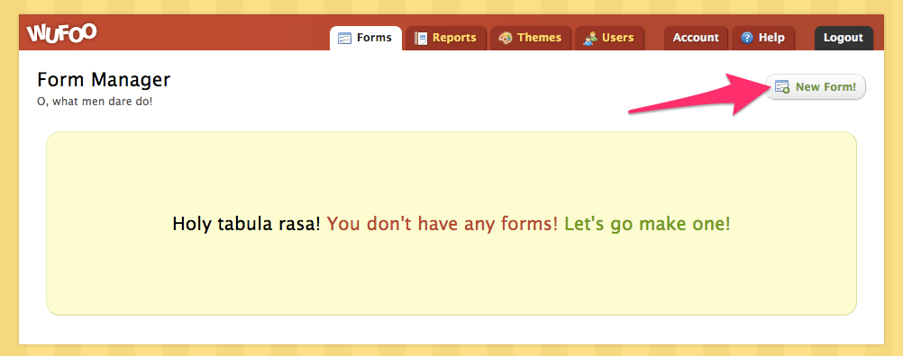
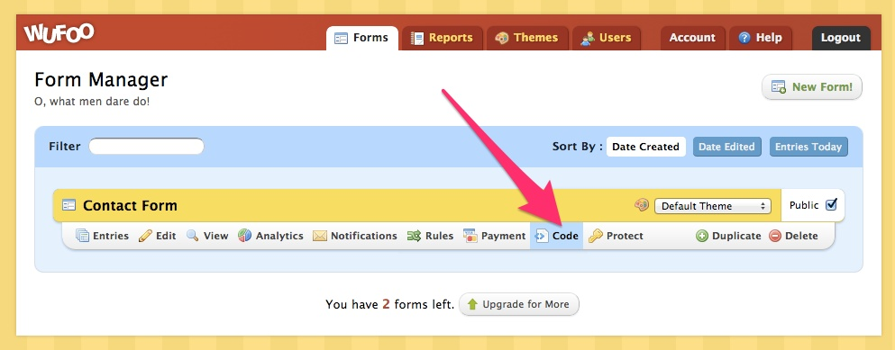

# How to add a contact form

This recipe shows you how to add a contact form to your Harp application.

There are a lot of services online that provide form solutions, but we’ve found that [Wufoo](http://www.wufoo.com/) is the easiest to integrate and it’s free as long as you have less than 100 entries per month.

## Wufoo Setup

Go to Wufoo’s website and [signup for a free account](https://secure.wufoo.com/signup/1/). You can keep it free until you reach more than 100 entries per month.

Once your account is setup, let’s create a new form and get the embed code to paste in our Harp project!

To do that, go to your Wufoo’s dashboard and click on the “New Form!” button.



Add any fields that you want yor visitors to fill out, and then hit the “Save Form” button:


The “Contact Form” is now ready to be embedded. Go back to the “Form Manager” page, find your form and click on the ”Code” option, which will take you to the page with options to embed your form.



Once you’re on the “Code” page, go to the “Embed Form Code” option on the left side tabs, click on the first textarea (“JavaScript Version (Recommended)”) and copy that code.


## Harp setup

For this recipe, we’re going to have 2 files, one with the embed code from Wufoo and another one where we’re going to import the contact form. That way we keep our project client and it allow us to re-use the form anywhere we want in the project.

```
/_contact.html
/index.jade  // or index.ejs
```

Create the `_contact.html` file and paste the embed code provided by Wufoo (see previous step). All the embed codes are different, make sure you use your own and not the one shown here:

```html
<div id="wufoo-z1euubrj12paw5g">
Fill out my <a href="https://thurstonharp.wufoo.com/forms/z1euubrj12paw5g">online form</a>.
</div>
<script type="text/javascript">var z1euubrj12paw5g;(function(d, t) {
var s = d.createElement(t), options = {
’userName’:’thurstonharp’, 
’formHash’:’z1euubrj12paw5g’, 
’autoResize’:true,
’height’:’517’,
’async’:true,
’host’:’wufoo.com’,
’header’:’show’, 
’ssl’:true};
s.src = (’https:’ == d.location.protocol ? ’https://’ : ’http://’) + ’wufoo.com/scripts/embed/form.js’;
s.onload = s.onreadystatechange = function() {
var rs = this.readyState; if (rs) if (rs != ’complete’) if (rs != ’loaded’) return;
try { z1euubrj12paw5g = new WufooForm();z1euubrj12paw5g.initialize(options);z1euubrj12paw5g.display(); } catch (e) {}};
var scr = d.getElementsByTagName(t)[0], par = scr.parentNode; par.insertBefore(s, scr);
})(document, ’script’);</script>
```

Now create your index file (`index.jade` or `index.ejs`), lets add a title and use `_contact.html` as a partial:

### Using index.jade

```
h1 Contact Us
!= partial("_contact.html")
```

### Using index.ejs

```
<h1>Contact Us</h1>
<%= partial("_contact.html") %>
```

And you’re done. When you go to the index page you should see the “Contact Us” title and your form embedded from Wufoo.

You don’t need to worry about spam, security, validation code or sending emails, that can all be configured from your Wufoo dashboard.

## How does it work?

There’s not much that Harp is doing for you here, it’s all powered by Wufoo. 

The code provided by Wufoo, generates an `iframe` hosted on their site, which contains all the code necessary to get the form working, but to your visitors this seems like it’s on your site.

We encourage you to explore the other options for embedding your form, as they might work better for you. We chose the iframe option because it’s the easiest to implement.


